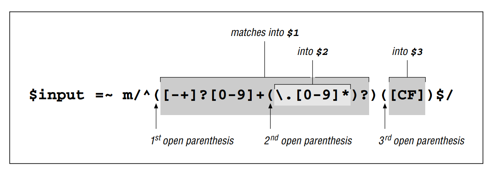

# Expanding the Foundation
## Linguistic Diversification
Like other languages, the regular expression language has various dialects and accents. Each new program employing regular expressions devises its own 'improvements' results in a wide variety of regular expression 'flavors'.

## The Goal of a Regular Expression
A regex expression either matches within a lump of text (with egrep, each line) of it doesn't. So the ultimate goal should be A ongoing tug-of-war between having your regex:
- match the lines you want
- not matching line you don't want.

## A Few More Examples
### Variable Names
Many programming languages have identifiers (variable names and such) that are allowed to contain only alphanumeric characters and underscores, but may not begin with a digit.
The regex for them:
```
[a-zA-Z_][a-zA-Z_0-9]*
```

### A string within double quotes
```
"[^"]+"
```

> Match opening and closing double quotes of the string, between them we can have anthing except another double quote

### Dollar amount (with optional cents)
```
\$[0-9]+(\.[0-9][0-9])?
```

> match a dollar sign ($) then match 1 to n number from 1 -> 9 then match 0 to n sequence of dot followed by a number from 0 -> 9 followed by a number from 0 -> 9

## Regular Expression Nomenclature

## Intertwined Regular Expressions
Since we use that first set to capture the number to compute, we want to make sure that they capture the fractional portion as well. However, the added set of parentheses, even though ostensibly used only to group for the question mark, also has the side effect of capturing into a variable. Since the opening parenthesis of the pair is the second (from the left), it captures into $2


## Non-Capturing Parentheses
In the regex ```^([-+]?[0-9]+(\.[0-9]+)?)([CF])$``` (used to match input like 25.02C (celsius)). @e use the parentheses of the ```(\.[0-9]+)?``` part for the grouping property, so we could apply a question mark to the whole of ```\.[0-9]+``` and make it optional. Still, as a side effect, text matched within
these parentheses is captured and saved to $2 (which we don't use)

Rather than using ```()```, which group and capture, you can use the special notation ```(?:)```, which group but do not capture

So if the regex becomes ```^([-+]?[0-9]+(?:\.[0-9]+)?)([CF])$```. Now the group ```[CF]``` will goes to $2

## How do ```[\s\t]*``` and ```(\s|\t)``` compare?
```(\s|\t)``` allows either ```\s``` or ```\t``` to match, which allows either allows some spaces (or nothing) or some tabs (or nothing). It does not allow combination of spaces and tabs

On the other hand, ```[\s\t]*``` matches ```[\s\t]``` any number of times. With a string such as: a tab follows by 2 spaces, it matches three times, a tab the first time and spaces the rest.

## Useful shorthand
- \t a tab character
- \n a newline character
- \r a carriage-r eturn character
- \s matches any “whitespace” character (space, tab, newline, formfeed, and such)
- \S anything not !\s"
- \w ```[a-zA-Z0-9R]``` (useful as in ```\w+```, ostensibly to match a word)
- \W anything not ```\w```, i.e., ```[^a-zA-Z0-9R]```
- \d ```[0-9]```, i.e., a digit
- \D anything not ```\d```, i.e., ```[^0-9]```